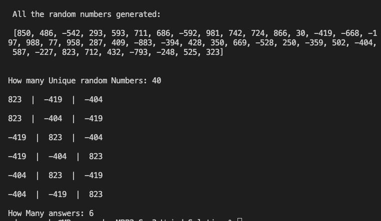

# Sum3-Weird-Solution
## Solution to Sum3 problem with a weird solution :) 

## Not the ideal solution to a Sum3 problem but my fun take on it. Overcomplicated for no reason. 

## Example solutions:
- https://www.youtube.com/watch?v=jzZsG8n2R9A
- https://stackoverflow.com/questions/41524919/3sum-finding-all-unique-triplets-in-a-list-that-equal-0
- https://shareablecode.com/snippets/3sum-python-solution-leetcode-dm41-DTbP

# Sample Output from Program:

 