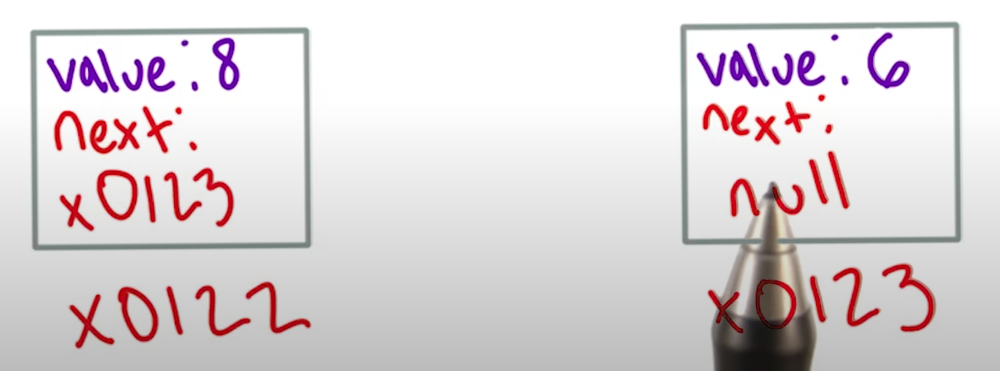
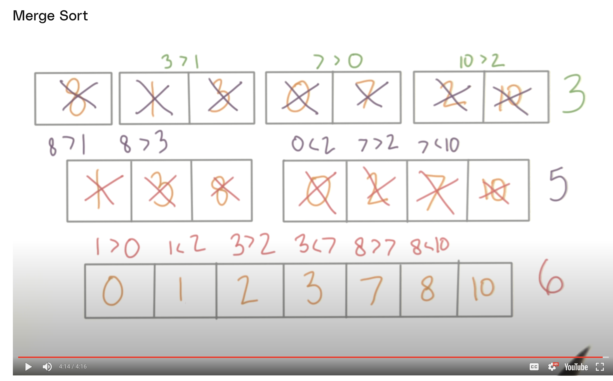
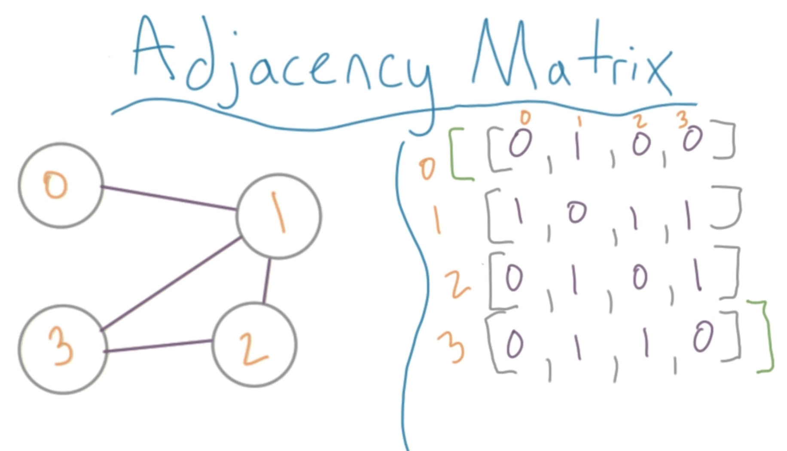

# Intor to Data Strucutes and Algo's

[Link: Udacity Site](https://learn.udacity.com/courses/ud513/lessons/a7bd2ec6-dec4-4f3a-8282-9d452d0cb693/concepts/b646f4e9-dc62-48dd-a058-2cdd1f35df4f)

## Lesson 1
[](https://mermaid.live/edit#pako:eNpdU8tu2zAQ_BWCAXqiD6kPQVWggCzJjh3LDiI0F8oHllpZRCVS4KOtG-TfQ1JuY-ek3dnZWe2QfMFcNYATfNRs7ND2qZYIpfS7AY3W0oJuGYcDms2-ocWEps52IK3gzAol0acIKC3-xvwQ-heRn9EnYP3MigFQCcawo5DHWM9iPacTCqiySvtvrOWxVtBCcn0azyMq4E4Le4qMNDKW9NGZDu2UFe35X8yF-Io-K8HB9z6LBhTKWN9fj7-nK63ciLKO2cvONX3UYEDG5soy6y6rG7oUfaiU0AiGqo7pa9kHWgHTvPOUTMlfoM3kU8mkX3HwzkVyEclbmkrWn7yZJkgqKbwTk14gGfdjOpYs34UcoZIWTTAMtFdGt4cJ3V2hn8_o_gqdRxRkM0lv4vwyhOW02DsaZ-0-ovsQ7v-hIeE9MyaHFnE1jEr61QxqRd8nN-2X9q69I8Zq9ROSm_l8fo5nv0Vju-R2_PP1vwJKyYJkJCcFWZIVuSdrsiEPZEtKsiP7C_FaYoIH0AMTjb-xL0Ghxv42DlDjxIcNtMz1tsa1fPVU5qyqTpLjxGoHBLuxYRZywbypA05a1huP-nP0ppfTK4iP4fUNrtD5Dw)

### Big O

#### Time Efficency 

- Notation 0(n) - n being some algebraic notation.
- example:

``` func decode(input):
        create outputstring
        for each letter in input
            get new_letter from letter local in cipher
            add new_leeter to put
        retunr output
```

- O(2n + 2) or O(3n + 2) or O(29n + 2)
- So we Drop teh constants and just keep O(n)
- 10 lines of code > O(2 * 10 + 2) == 22 * Time of each line
 - Hard to know exactly how much code will run 
 - - with C you might have more code but less Work since its low level
- - with Python - Less code but more Work since its High level
- - [Link: Effiencies Wikipeaia](https://en.wikipedia.org/wiki/Time_complexity#Table_of_common_time_complexities)
- Efficensy is talked usually in Worse case (Going through all 26 Letters) but can also use Best/Average case. 

#### Space Efficency 

[Link to Cod 1-11 Efficency Practice](1-11-Efficency-Practice.py)

[Link: BIg O Cheat Cheat](https://www.bigocheatsheet.com/)

---

## Lesson 2

### Collections

- Data structures are extensions of collections

#### Arrays

- List's with a few added rules
- some langauges only allow single data types other langauges allow multi data type sin a single array
- each array has an index starting with 0 

[Link: time complexity](https://wiki.python.org/moin/TimeComplexity)

- Python has an interesting data stucture called a "list" that is much more than a mere list. In fact, a Python list actually encompasses the functionality of almost every list-based data structure in this lesson.

- Behind the scenes a Python list is built as an array. Even though you can do many operations on a Python list with just one line of code, there's a lot of code built in to the Python language running to make that operation possible.

- For example, inserting into a list is easy (happens in constant time). However, inserting into an array is O(n), since you may need to shift elements to make space for the one you're inserting, or even copy everything to a new array if you run out of space. Thus, inserting into a Python list is actually O(n), while operations that search for an element at a particular spot are O(1). You can see the runtime of other list operations here.

- Python is a "higher level" programming language, so you can accomplish a task with little code. However, there's a lot of code built into the infrastructure in this way that causes your code to actually run much more slowly than you'd think. Keep this in the back of your mind when using Python. You likely won't need to know the details of how Python works behind the scenes in a programming interview, but you'll seem very impressive if you do!

#### Linked List

- Extension of an array but not an array
- Adding/Remvoing is a lot easier vs Array
- Higher level lagauges might not have a distinction

- Adding new item is just changing the next pointer
- - But get the value of of x0123 before adding onet here
- Doubly Linked lists
- has prior and next links

#### Stakcs

- Putting things on top - Highest value is the last item to be put and can only be removed first. 
- Push/ Pop
- contant time for operations O(1)
- Can use different data types: Linked Lists
- LIFO - Last In First Out


#### Queues

- FIFO - First in First Out
- Oldest elemnt comes in first
- Oled item is Head - latest is Tail
- Dequeue (Removing Head
- Enqueue - Adding new item
- Peek just to see inside
- Impletemnt a link list as well with Refs to Head/Tail

##### Deques: Enqueue/Dequeue in both Ways. 

##### Priority Queue

- Assing each element a priority when adding to the queue 
- When Dequeue you remove element with highest priority. 
- - if all elements have same priority then the oldest one gets removed


## Lesson 3  - Searching and Sorting 

### Binary Search

- Sorted array can do binary search
- See if middle element is higher/lower then element were looking for and then change goal posts.
- Efficencecy is O(log(n))

### Recursion 

- Function that calls itself
- base case that is chekcing for when to stop - without it would be infinite
- Need to alter the counter to not have infinite loop

``` python

def recur(input):
    if input <= 0:
        return input
    else:
        output = recur(input-1)
        return output
```

### Sorting

- sorting by some Value ex: Sort by Height, Name, Number
- Naive approach: Compare one element to the next
- In place: Rearanges elems in the same Data Struct - so lower space Complexity
- Out Place: rearage elms in a different data structture 

#### Bubble sort

- Naive approch - comparing each element then switching them. 
- if x1 is bigger then x2 switch places, if new x2 is bigger then x3 switch.

- Efficency: interations N-1 comparisions n-1 = n^2 - 2n + 1 = o(n^2)
- Spac ecomplexity is constant - its in Place Sorting

##### Bubble Sort Practice
- Sorting techniques can be tricky—sometimes the best way to understand them is to watch a visual of a sorting algorithm in action again and again. When I was first learning sorting, I used to check out the Wikipedia page for each sort. There's normally some colorful illustration near the top, then a GIF showing the sort in action. There are plenty of other visualizations on the World Wide Web—take the time to look around if you need it!


#### Merge Sort

- Very popular
- Split array down and build it back up
- Divide and Conquer - Popular method



- Efficency O(n log(n))
- Space effiecnly worse then Bubble sort
- Time efficency better than Bubble sort

[Link: merge sort](https://algs4.cs.princeton.edu/22mergesort/)


#### Quick Sport
 
 - In many cases its the most efficent one
 - Pick a elemnt by random and move all values larget above it and all bellow values lower it
 - This is called a Pivot - keep doign this till whole array is sorted

 ##### Example
 ``` 8,3,1,7,0,10,2 ```

 - Convention ssays the get the last element. 
 - CHose 2 - switch with 8 > etc
 - Effiecency is pretty comlicated
 - - Worst Case:

 [Link: Visiual Algo help with Sorting](https://visualgo.net/en/sorting)

 ## Lesson 4 - Maps
 
 - Key / Value Pair - similar to Dictionary
- keys in a map are a set - they are unuique 

### Sets

- Similar to list but doesnt allow repeats and is unordered.

### hashing Functions

- Value > Hash with some Function 
- Often an index in an array
- Collisons can Occur
- change value of collison and add it to a new spot
- - Good for constant time lookup but everytiem you will have to change your array
- Can store both collions in one spot (Bucket)
- - good but you dont want to store everythign in one buvet
- - Can do hashing again for those buckets if you have a lot \
- - ideally have 1-3 elemements in a singl ebucket

#### When we're talking about hash tables, we can define a "load factor":

- Load Factor = Number of Entries / Number of Buckets
The purpose of a load factor is to give us a sense of how "full" a hash table is. For example, if we're trying to store 10 values in a hash table with 1000 buckets, the load factor would be 0.01, and the majority of buckets in the table will be empty. We end up wasting memory by having so many empty buckets, so we may want to rehash, or come up with a new hash function with less buckets. We can use our load factor as an indicator for when to rehash—as the load factor approaches 0, the more empty, or sparse, our hash table is.

- On the flip side, the closer our load factor is to 1 (meaning the number of values equals the number of buckets), the better it would be for us to rehash and add more buckets. Any table with a load value greater than 1 is guaranteed to have collisions.
 

 ### Hash Maps
  
- Pyton Dictionary are Hash Maps
- Cna really spead up your code

### String Keys

- convert Letters to Number as ASCII
- - a = 65, B = 66, C = 67


## Lesson 5 - Trees

- Looks like a Tree with Branches, Leaves, Forest, etc
- Tree is an extension of a Linked List
- Tree is Root, and can have several next elements. 
- - Tree must be fully connected to be one -starting at root you can get anywhere. 
- - Must not be any cycles - cant have connections back to other nodes

### Levels 

- How many connections it takes to reach teh bottom + 1 

- Parent/Child relationship and Siblings called Internal Node
- Ancestor and descendant 
- Those who dont have Children are Leave/Exit Notes
- Height # of edges between it and the farther node on a tree
- Leaf has height of 0 but parent of leaf is 1 
- Depth - number of edges to teh root - Botton leaf is 2 depth to root

### Tree Traversal 

- Its not linear so how should we visit each element

1. Depth First Search DFS
- - Explore child nodes first
- Pre-Order: check of a node as soon as you see it before you move on

- in-order: Check of once we have seen its left child 

- post-order: Dont check of a node until we saw all descendants 
2. Breath first Search BFS
- - Priority is to vist every node level by level (Level Order Traveral)

### Binary Tree

- Tres where parents have at most 2 Children, Null, 0, 1 or 2

#### Search
- - Any trasveral algo can work ( Linear time search) O(n)

#### Delete
- - Starts with Search 
- - If deleting a Leaf thats fine
- - If Deleting internal node youll have a gap
- if 1 parents
- - Jst move node up to parents of internal node
- 2 parents
- - Option 1 - Promote Child up
- - option 2 - Keep traverrsing until you hit a leaf (O(n))

#### Insert 

- Easy, as long as we obey 2 child room 
- Move down until we find an open spot (Not 2 children yEt)
- How long will that take:

> Worst Case:

- Height of the binary tree
- Each new level has a capacity to grow by 2x on each Row 
- Row 1 = 2 Nodes = 2 Rows = 4 Nodes etc 

### BInary Search Tree ( BST (s) )

- Sorted small to big left to right
- Find 7 if root is 5 go right

- Inserting - Compare and then insert

- Deleting - Same as general Tree

- Unbalanced BST Everything on one end 
- - worst case for searching O(n)
- - Average case O(log(n))

#### Heaps

- Type of tree with rules 
- Arranged in Increasing or decreasing ORder  - Such as the Root is always eitehr MAX or MIN
> Type 1: Max Heap
- - Parent must always have greater value than child

> Type 2: Min Heap
- - parents must have lesser value than child

- They do not have to be Binary Tree
- Heap must be complete, like iphone icons. Left to right must be filled. Can have floating ones

- Searchign is Linear Time O(n) worst case
- Average time O(n/2) but really O(n)

- Insert
- - Heapify - comparing child to parents until in order of Smaller/bigger 

- Implemnations 
- - Stored as arrays 

#### Self Balacning Trees
- Unbalanced all nodes on one level
- balanced all nodes every spread out

#### Red Black Tree = Similar to Binary Search Tree
- If Parents doesnt have Leafs then missing leafs are set as Null oposite of color of Parent 
- Optional rule must be black

- Usefull rule
- Every path from a node to a decendes node must contain teh same black nodes

> Inserting Node
 - Red black tree and BST rules
 - Insert Red Nodes Only
 - Change color as needed

## Lesson 6 - Graph or Network

- Data structure desinged to show relationship between different objects
- Not a Line graph or Chart
- Similar to a tree - but tree is just a specific Graph

- Graphs dont always have a root node 
- Nodes and Edges can contain data
- Edges can show how many times someone has talke dot someone in a week

> Direction
- Edges can have a direction
- Start and stop of cities for a fligth 
- Can Have to edges per nodes - flights back and forth 
- Cna have Cycles 
- - Try not to get an infinite loop
- - dAG Directed Asyclic Graph - No Cycles

> Connectivity - Graph Theory
- Disconnected graph has a node(s) with not connection to another node(s)
- connected are all nodes 

- How strong connections are 
- the more connections the stronger the connectivity - Friends who all know each other vs random people of freinds 

- Graph Practice
Let's discuss a few more definitions that extend on the topics from the last few videos.

Talking about connectivity in a directed graph is a bit more complicated than in an undirected graph. Let's look at some more definitions:

Disconnected
Disconnected graphs are very similar whether the graph's directed or undirected—there is some vertex or group of vertices that have no connection with the rest of the graph.

Weakly Connected
A directed graph is weakly connected when only replacing all of the directed edges with undirected edges can cause it to be connected. Imagine that your graph has several vertices with one outbound edge, meaning an edge that points from it to some other vertex in the graph. There's no way to reach all of those vertices from any other vertex in the graph, but if those edges were changed to be undirected all vertices would be easily accessible.

Connected
Here we only use "connected graph" to refer to undirected graphs. In a connected graph, there is some path between one vertex and every other vertex.

Strongly Connected
Strongly connected directed graphs must have a path from every node and every other node. So, there must be a path from A to B AND B to A.

> Vertex object
- Edges

> Edge Object
- Verticies 

> Adjacency Matrix


### Graph Traversal 

> Depth First search - Across the board tehn move to next on 
- Begin with any node and mark it as seen
- Use a stack 
- Pick an edge and follow it and add to stack
- Keep repeating - 
- When seen a node already seen go down a different branch
- O(2 E + V )

> Breath first search : Look at nodes adjacent to each other
- queue - Remove first element we put in it 
- See each node connected then to otehr branches

#### Notable Path - Eulerian Path
- Oilerian Path

> Hamiltonian Path


## Lesson 7 - Case Studies in Algorithms

### Shortest Path Problem
- Finding shortest path in a graph
- Weighted or Non matters
>  Unweighted
- Just a Breath First Shearch - least number of edges


### Dijkstra's Algorithm
- O(V^2)
- 

### Knapsack Problem


### Heaps

- In computer science, a heap is a specialized tree-based data structure which is essentially an almost complete[1] tree that satisfies the heap property: in a max heap, for any given node C, if P is a parent node of C, then the key (the value) of P is greater than or equal to the key of C. In a min heap, the key of P is less than or equal to the key of C.[2] The node at the "top" of the heap (with no parents) is called the root node.
- parent > i the Left Child is 2i +1 and Right Child is 2i + 2
- child > i the parent is i/2 -1 
- Heap is a complete binary tree (Or almost complete) and stored in array
- Max array size (2^h+1) - 1 for a perfect tree (all nodes have 2 Child nodes )
- Max nodeas at height = h = 2^h ex: Height 0 1 node, Height 1 2 Nodes, Height 2 4 nodes
- Max nodes in entienr tree of Height is h=(2 ^(h+1)) -1) ex: 2 ^ 3+1) -1 = 7 for a Perfect Binary Tree (PBT)
- range of leaves n/2 + 1 to N
- range of internal nodes > 1 to n/2

#### Max Heap: Root node is the MAX number in tree

#### Min Heap: Root node is the MIN number in tree

#### Heapify Algorithm or Percolate Down Algo
> Important points
- The eprocess of rearanging the heap by comparing each parrent with its children RECURSIVLEY is know as heapify
- 


%20Heapify%20Algorithm%20%7C%20Max%20Heapify%20%7C%20Min%20Heapify%20-%20YouTube.png)
``` python
def max_heapfiy(array: list[int], indexI: int)-> list[int]:
	leftChild = 2 * indexI + 1 # Get the left child index 
	rightChild = 2* indexI + 2 # get the right child index
# Checking to see if LeftChild is actually there if not then this is a leave - then checking if leftChild is bigger then indexI 
	if (leftChild <= len(array) and array[leftChild] > array[indexI]:
		largest = leftChild # assignign the largest index to leftChild index
	else:
	larget = indexI @ if leftchild is smaller than indexI then setting it to largest
## Same thign with right Child here

	if (largest != indexI): #if the indexI is not the same as the largest then we need to swap
		#swap (array[indexI], array[largest])
		array[index], array[largest] = array[largest], array[index]
		# recursivley call to check lower nodes
		max_heapify(array, largest)
```


#### Build a heap

> Recap - For a comlete binary tree 
- If Heapsize = N
- - then range of leave = (n/2) to (n-1)
- - Rnag eof internal nodes = 0 to (n/2) - 1
- - if parent = i then lchild = 2i+1 and rchild 2i+2
- - if child = 1 then parent = i/2 -1

> Heapify from bottom up 

[LINK: HEap in Python Code](https://youtu.be/HgykGry9k3Y0)

[LINK: HEap in Python Code](https://youtu.be/laYrbOAmuvQ)

 