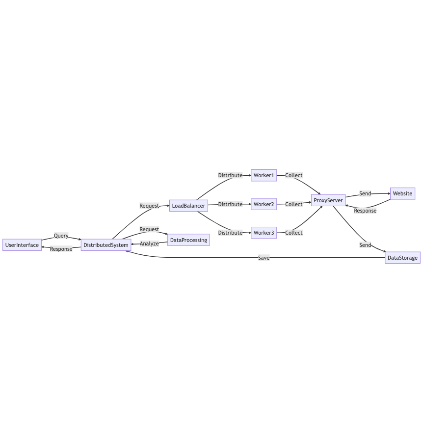

# Youtube

[](https://mermaid.live/edit#pako:eNqFk9tu4yAQhl8Fcd2-QC4qxYecGidu0u4N7sXETB20NkSAW0VV330B03qTVbR33_zMAf0wn7RWHOmENhpOR_KcVZIQ0x-G8MWgNl4hZMpC8OojlLySF4mpkhalJS-nVgEfKhJ2qd4o_SU4KlJqVaMxQjZDccqu9dfhIIsHuXQXH-WcPWuQ5i_t30l7qzQ0OBTMWAxjgznLwMIBzLewYJkwVotDb5GTmWiR7M_GYvcfCzJsxTvq89Blya712H7F0mwT-ZHlvEGSQn3EWw5Py-WQvGYOY2HhmczB4gd8N96wtTObJNCCrFFHdcsSqH-7tmSP-l3UN-fssFZd53SwQsn4-CW7kmPXJ1a4OwuJZI2gpbOeTNtGaWGP3e0BJ6Xtz0Pv2I9wWTAl9_cPJPGYBEw9pgHDL80C5h7zgDOPs4DzERceFwGDg8uAK4-rgI8e1wELj0XAjcdNwK3H7XiH7ThtwNJjGfBpVHeVpHe0Q92B4G7DPv1RRe0RO6zoxCHHN-hbW9FKfrlU6K3an2VNJ1b3eEf7k3MbMwHOuI5O3qA1TkUu3Mcthq0Ny_v1B0pYMSw)

# Facebook Messenger

 	#### Technologies for Facebook Messenger-like System Design

- **User Interface (UI):**
    - Frontend frameworks: React, Angular, or Vue.js
    - Mobile app development: React Native, Flutter, or native development using Swift (iOS) and Kotlin (Android)

- **User Authentication and Authorization:**
    - OAuth 2.0 or OpenID Connect for third-party authentication
    - JWT (JSON Web Tokens) for managing user sessions and authorization
    - Backend frameworks like Django, Express, or Ruby on Rails for implementing custom authentication logic

- **Real-time Messaging:**
    - WebSocket protocol for real-time, bi-directional communication between the client and server
    - Socket.IO or WebRTC Data Channels for managing WebSocket connections and real-time communication

- **Message Storage:**
    - Relational databases like PostgreSQL, MySQL, or MariaDB for storing message data and conversation metadata
    - NoSQL databases like MongoDB or Cassandra for storing large volumes of unstructured or semi-structured data

- **Encryption and Security:**
    - TLS/SSL for encrypting data in transit
    - End-to-end encryption libraries like libsodium or the Signal Protocol for encrypting messages and media

- **Push Notifications:**
    - Firebase Cloud Messaging (FCM) for Android
    - Apple Push Notification service (APNs) for iOS
    - Third-party services like OneSignal or Pusher for cross-platform notifications

- **Voice and Video Calling:**
    - WebRTC for peer-to-peer audio and video communication
    - STUN/TURN servers for NAT traversal and establishing connections between peers

- **Group Chats:**
    - Backend frameworks like Django, Express, or Ruby on Rails for implementing group chat logic
    - Real-time messaging technologies like WebSocket or WebRTC for updating group members' chat status and messages

- **Presence and Status:**
    - Redis or other in-memory data stores for maintaining user presence and status information

- **File and Media Sharing:**
    - Cloud storage services like Amazon S3, Google Cloud Storage, or Microsoft Azure Blob Storage for storing and serving multimedia content

- **Search and Conversation Management:**
    - Full-text search engines like Elasticsearch or Apache Solr for searching and indexing message data
    - Relational or NoSQL databases for managing conversation archives and organizing messages

- **Analytics and Monitoring:**
    - Monitoring tools like Prometheus, Grafana, or Datadog for tracking system performance and resource usage
    - Application performance monitoring (APM) tools like New Relic or Dynatrace for tracking application-level metrics

Note: These technologies are just examples of the tools and frameworks that can be used to build a messaging platform like Facebook Messenger. The specific choices will depend on factors such as your existing technology stack, team expertise, and project requirements.

 

[](https://mermaid.live/edit#pako:eNpdU8tu2zAQ_BWCAXqiD6kPQVWggCzJjh3LDiI0F8oHllpZRCVS4KOtG-TfQ1JuY-ek3dnZWe2QfMFcNYATfNRs7ND2qZYIpfS7AY3W0oJuGYcDms2-ocWEps52IK3gzAol0acIKC3-xvwQ-heRn9EnYP3MigFQCcawo5DHWM9iPacTCqiySvtvrOWxVtBCcn0azyMq4E4Le4qMNDKW9NGZDu2UFe35X8yF-Io-K8HB9z6LBhTKWN9fj7-nK63ciLKO2cvONX3UYEDG5soy6y6rG7oUfaiU0AiGqo7pa9kHWgHTvPOUTMlfoM3kU8mkX3HwzkVyEclbmkrWn7yZJkgqKbwTk14gGfdjOpYs34UcoZIWTTAMtFdGt4cJ3V2hn8_o_gqdRxRkM0lv4vwyhOW02DsaZ-0-ovsQ7v-hIeE9MyaHFnE1jEr61QxqRd8nN-2X9q69I8Zq9ROSm_l8fo5nv0Vju-R2_PP1vwJKyYJkJCcFWZIVuSdrsiEPZEtKsiP7C_FaYoIH0AMTjb-xL0Ghxv42DlDjxIcNtMz1tsa1fPVU5qyqTpLjxGoHBLuxYRZywbypA05a1huP-nP0ppfTK4iP4fUNrtD5Dw)

[](https://mermaid.live/edit#pako:eNp9VM1u4jAQfhUrhz2VF-CwEkmAjYRRVAsuTg_TZACriY1sp1W26rvvQKgyS6vmkm_mmz_PjP2e1K7BZJ4cPZxPYvNYWUFf6J9HRdYatHFUXr5doXcBvShsRH-AGp9GDm1T2TvfRVmINUR8g2EKsNZM_YNzCvUL6YVC_2pqDFOEhV708URVmRqicVb8EheF8-bvVX6aTKV-RGhn0XQoJIYAR2OPjFd61KJQ0Xn6M26pl7b2w_mWQmHdexMHZlHqsg8nsXXRHG61BEbv9d5R5eS7Nw06kUHb_p9-nf3Ra-_6s8hOELlvqXTpMaC9-qsIsef0Sq9Me2EkNgaEOoG_O1imFYKvT2STOfuKPoy9kmDpmB1174feF_bgIUTf17H3OEXdpHrjoKHZtECVeZYwy7eaEkUKLHJsDWUcxBbjm_MvzCxPdQ4RniHwVhdSF3YmsXPkdOGv4-AWmdJZ6_rmbk7fbp2FdqDdCJf2OGvIgXrD1kfq702-xtwVs9nv9YjXBBcTlBNUE1xOsJzgfoI0cWbCPFcsXsYyys9aFiRt0hFLhhXDS4ZLhvcMUwXciruveNjsJoziJiUxT5lAA2dSITmlPt3y9HaG24owqZCcUjcheUg69B2Yhp6k9wtZJXTXO6ySOcEGD9C3sUoq-0Gm0EenBlsnc9pVfEj6c0PvSm6ANqFL5gdoA2npitCA5fjMXV-7j3_1j3IG)

 

# Web Crawler System Design

## Components
- **Crawler Algorithm**: Determines how the web crawler traverses the web and collects data.
- **Data Storage**: Stores the data collected by the web crawler in a database for later processing.
- **Data Processing**: Processes and analyzes the collected data to extract insights.
- **User Interface**: Provides a web interface for users to enter search queries and view the results of the web crawler.
- **Distributed System**: Distributes the workload of the web crawler across multiple machines.
- **Load Balancer**: Balances the load of the web crawler across multiple machines.
- **Proxy Server**: Handles requests from the web crawler and avoids getting blocked by websites.

## Technologies Used
- **Crawler Algorithm**: Depth-first search or breadth-first search.
- **Data Storage**: MongoDB or Cassandra.
- **Data Processing**: Apache Spark or Apache Hadoop.
- **User Interface**: React or Angular.
- **Distributed System**: Apache Kafka or RabbitMQ.
- **Load Balancer**: Nginx or HAProxy.
- **Proxy Server**: Crawlera.
 

**A web crawler**, also known as a web spider or web scraper, is a program or script that systematically browses the web, collecting information and data from websites. Here's a high-level design for a web crawler, along with the components, technologies used, explanations, and potential drawbacks:

**Seed URLs:**
- The crawler starts with a list of seed URLs, which are the initial websites that will be crawled.

**URL Frontier:**
- The URL frontier is a data structure that holds URLs to be crawled. It can be implemented using a queue or priority queue. This component is responsible for managing the order and priority of URLs to crawl.
- Technology used: Redis or RabbitMQ for maintaining the queue, ensuring persistence, and supporting distributed crawling.

**Fetcher:**
- The fetcher retrieves the content of web pages by making HTTP requests to the URLs in the URL frontier.
- Technology used: Python libraries like Requests or Node.js libraries like Axios for making HTTP requests.

**Parser:**
- The parser extracts relevant information and links from the fetched web page content.
- Technology used: BeautifulSoup or lxml for Python, or Cheerio for Node.js to parse and extract data from HTML.

**Content Processor:**
- The content processor is responsible for processing and cleaning the extracted data. This may include removing HTML tags, filtering out irrelevant content, and converting the data into a structured format.
- Technology used: Custom code in Python, Node.js, or other programming languages.

**Data Storage:**
- The processed data is stored in a suitable storage system for later use, analysis, or indexing.
- Technology used: Databases like PostgreSQL, MySQL, or Elasticsearch for storing structured data, and distributed file systems like Hadoop HDFS or cloud storage services like Amazon S3 for storing raw content.

**Link Extractor:**
- The link extractor identifies new URLs from the parsed content and adds them to the URL frontier for future crawling.
- Technology used: Custom code in Python, Node.js, or other programming languages using regular expressions or HTML parsing libraries.

**URL Deduplication:**
- The URL deduplication component ensures that the same URL is not crawled multiple times by maintaining a record of already crawled URLs.
- Technology used: Data structures like Bloom filters or databases like Redis for storing and checking the crawled URLs.

**Rate Limiter & Politeness:**
- The rate limiter controls the crawl rate to avoid overloading websites and adheres to the rules specified in the robots.txt file of each website.
- Technology used: Custom code in Python, Node.js, or other programming languages to implement rate limiting and politeness policies.

**Monitoring & Analytics:**
- The monitoring and analytics component collects and analyzes metrics related to the performance and efficiency of the web crawler.
- Technology used: Monitoring tools like Prometheus, Grafana, or Datadog to track system performance and resource usage.

**Drawbacks:**
- Scalability: A web crawler can face scalability issues as the number of websites and pages to crawl increases, requiring more resources and efficient algorithms to handle the workload.
- Legal and ethical concerns: Web crawling can raise legal and ethical issues related to data privacy, copyright, and terms of service of the websites being crawled.
- Incomplete or biased data: A web crawler might not be able to access all the content on the web, leading to incomplete or biased data collection. This can be due to websites blocking crawlers, content behind login screens, or dynamically generated content.
- Performance: Crawling a large number of web pages can be resource-intensive and slow, requiring optimization of the crawling process, storage, and data processing to maintain acceptable performance.

)

)

)
