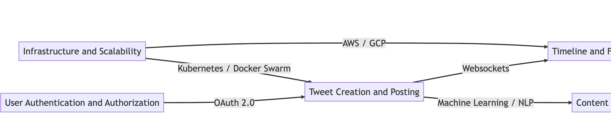

# Youtube

**User Authentication and Authorization:**

- This function handles user registration, login, and management of access permissions for different users and user groups.

**Video Upload and Processing:**

- This function manages the uploading of videos, transcoding them into various formats and resolutions, and generating thumbnails for efficient storage and playback.

**Video Storage:**

- This function is responsible for storing videos and related metadata, ensuring durability, redundancy, and high availability.

**Content Delivery Network (CDN):**

- This function deals with the distribution and caching of video content across a global network of servers, reducing latency and improving playback performance.

**Video Playback and Streaming:**

- This function provides adaptive video streaming, adjusting the quality of the video in real-time based on the user's device capabilities and network conditions.

**Search and Recommendation:**

- This function uses advanced algorithms and machine learning techniques to enable users to search for videos and receive personalized recommendations based on their interests and watch history.

**User Interface (UI):**

- This function ensures the user interface is responsive and visually appealing across various devices and platforms, allowing users to browse, search, view, and interact with videos.

**User Interaction:**

- This function manages user-generated content, such as comments, likes, dislikes, and subscriptions, and enables users to engage with one another and with the content on the platform.

**Video Monetization:**

- This function provides content creators with tools and options to monetize their videos through advertisements, channel memberships, and other revenue-generating features.

**Analytics and Reporting:**

- This function collects and analyzes user behavior, video performance, and other metrics to provide insights for content creators and help YouTube optimize its platform.

**Security and Privacy:**

- This function implements measures to protect user data, maintain platform integrity, and comply with privacy regulations.

**Notifications:**

- This function sends notifications to users about new video uploads, comments, and other activities related to their subscriptions and interactions on the platform.

)

# Facebook Messenger

## Technologies for Facebook Messenger-like System Design

- **User Interface (UI):**
  - Frontend frameworks: React, Angular, or Vue.js
  - Mobile app development: React Native, Flutter, or native development using Swift (iOS) and Kotlin (Android)

- **User Authentication and Authorization:**
  - OAuth 2.0 or OpenID Connect for third-party authentication
  - JWT (JSON Web Tokens) for managing user sessions and authorization
  - Backend frameworks like Django, Express, or Ruby on Rails for implementing custom authentication logic

- **Real-time Messaging:**
  - WebSocket protocol for real-time, bi-directional communication between the client and server
  - Socket.IO or WebRTC Data Channels for managing WebSocket connections and real-time communication

- **Message Storage:**
  - Relational databases like PostgreSQL, MySQL, or MariaDB for storing message data and conversation metadata
  - NoSQL databases like MongoDB or Cassandra for storing large volumes of unstructured or semi-structured data

- **Encryption and Security:**
  - TLS/SSL for encrypting data in transit
  - End-to-end encryption libraries like libsodium or the Signal Protocol for encrypting messages and media

- **Push Notifications:**
  - Firebase Cloud Messaging (FCM) for Android
  - Apple Push Notification service (APNs) for iOS
  - Third-party services like OneSignal or Pusher for cross-platform notifications

- **Voice and Video Calling:**
  - WebRTC for peer-to-peer audio and video communication
  - STUN/TURN servers for NAT traversal and establishing connections between peers

- **Group Chats:**
  - Backend frameworks like Django, Express, or Ruby on Rails for implementing group chat logic
  - Real-time messaging technologies like WebSocket or WebRTC for updating group members' chat status and messages

- **Presence and Status:**
  - Redis or other in-memory data stores for maintaining user presence and status information

- **File and Media Sharing:**
  - Cloud storage services like Amazon S3, Google Cloud Storage, or Microsoft Azure Blob Storage for storing and serving multimedia content

- **Search and Conversation Management:**
  - Full-text search engines like Elasticsearch or Apache Solr for searching and indexing message data
  - Relational or NoSQL databases for managing conversation archives and organizing messages

- **Analytics and Monitoring:**
  - Monitoring tools like Prometheus, Grafana, or Datadog for tracking system performance and resource usage
  - Application performance monitoring (APM) tools like New Relic or Dynatrace for tracking application-level metrics

Note: These technologies are just examples of the tools and frameworks that can be used to build a messaging platform like Facebook Messenger. The specific choices will depend on factors such as your existing technology stack, team expertise, and project requirements.

)

# Web Crawler System Design

## Components

- **Crawler Algorithm**: Determines how the web crawler traverses the web and collects data.
- **Data Storage**: Stores the data collected by the web crawler in a database for later processing.
- **Data Processing**: Processes and analyzes the collected data to extract insights.
- **User Interface**: Provides a web interface for users to enter search queries and view the results of the web crawler.
- **Distributed System**: Distributes the workload of the web crawler across multiple machines.
- **Load Balancer**: Balances the load of the web crawler across multiple machines.
- **Proxy Server**: Handles requests from the web crawler and avoids getting blocked by websites.

## Technologies Used

- **Crawler Algorithm**: Depth-first search or breadth-first search.
- **Data Storage**: MongoDB or Cassandra.
- **Data Processing**: Apache Spark or Apache Hadoop.
- **User Interface**: React or Angular.
- **Distributed System**: Apache Kafka or RabbitMQ.
- **Load Balancer**: Nginx or HAProxy.
- **Proxy Server**: Crawlera.

**A web crawler**, also known as a web spider or web scraper, is a program or script that systematically browses the web, collecting information and data from websites. Here's a high-level design for a web crawler, along with the components, technologies used, explanations, and potential drawbacks:

**Seed URLs:**

- The crawler starts with a list of seed URLs, which are the initial websites that will be crawled.

**URL Frontier:**

- The URL frontier is a data structure that holds URLs to be crawled. It can be implemented using a queue or priority queue. This component is responsible for managing the order and priority of URLs to crawl.
- Technology used: Redis or RabbitMQ for maintaining the queue, ensuring persistence, and supporting distributed crawling.

**Fetcher:**

- The fetcher retrieves the content of web pages by making HTTP requests to the URLs in the URL frontier.
- Technology used: Python libraries like Requests or Node.js libraries like Axios for making HTTP requests.

**Parser:**

- The parser extracts relevant information and links from the fetched web page content.
- Technology used: BeautifulSoup or lxml for Python, or Cheerio for Node.js to parse and extract data from HTML.

**Content Processor:**

- The content processor is responsible for processing and cleaning the extracted data. This may include removing HTML tags, filtering out irrelevant content, and converting the data into a structured format.
- Technology used: Custom code in Python, Node.js, or other programming languages.

**Data Storage:**

- The processed data is stored in a suitable storage system for later use, analysis, or indexing.
- Technology used: Databases like PostgreSQL, MySQL, or Elasticsearch for storing structured data, and distributed file systems like Hadoop HDFS or cloud storage services like Amazon S3 for storing raw content.

**Link Extractor:**

- The link extractor identifies new URLs from the parsed content and adds them to the URL frontier for future crawling.
- Technology used: Custom code in Python, Node.js, or other programming languages using regular expressions or HTML parsing libraries.

**URL Deduplication:**

- The URL deduplication component ensures that the same URL is not crawled multiple times by maintaining a record of already crawled URLs.
- Technology used: Data structures like Bloom filters or databases like Redis for storing and checking the crawled URLs.

**Rate Limiter & Politeness:**

- The rate limiter controls the crawl rate to avoid overloading websites and adheres to the rules specified in the robots.txt file of each website.
- Technology used: Custom code in Python, Node.js, or other programming languages to implement rate limiting and politeness policies.

**Monitoring & Analytics:**

- The monitoring and analytics component collects and analyzes metrics related to the performance and efficiency of the web crawler.
- Technology used: Monitoring tools like Prometheus, Grafana, or Datadog to track system performance and resource usage.

**Drawbacks:**

- Scalability: A web crawler can face scalability issues as the number of websites and pages to crawl increases, requiring more resources and efficient algorithms to handle the workload.
- Legal and ethical concerns: Web crawling can raise legal and ethical issues related to data privacy, copyright, and terms of service of the websites being crawled.
- Incomplete or biased data: A web crawler might not be able to access all the content on the web, leading to incomplete or biased data collection. This can be due to websites blocking crawlers, content behind login screens, or dynamically generated content.
- Performance: Crawling a large number of web pages can be resource-intensive and slow, requiring optimization of the crawling process, storage, and data processing to maintain acceptable performance.

)

## Web Crawler Security

To make a web crawler system secure, you can use the following techniques and technologies:

1. Input validation and sanitization:
   * Use regular expressions and input filters to validate and sanitize user input.
   * Avoid executing user input as code, and use parameterized queries in SQL statements.

2. Authentication and authorization:
   * Use secure authentication protocols like OAuth 2.0 or OpenID Connect.
   * Implement role-based access control (RBAC) to limit access to sensitive data and functions.

3. Secure communication:
   * Use HTTPS and SSL/TLS protocols to encrypt data in transit.
   * Implement certificate pinning to ensure secure communication with trusted servers.

4. Anti-scraping techniques:
   * Implement CAPTCHA or reCAPTCHA to prevent automated bots from accessing your website.
   * Use rate limiting and throttling to limit the number of requests from a single IP address.

5. Secure data storage:
   * Use encryption and hashing algorithms to protect sensitive data.
   * Use firewalls and network segmentation to isolate and protect your database servers.

6. Regular vulnerability scanning and penetration testing:
   * Use automated vulnerability scanners to detect vulnerabilities in your web application.
   * Conduct regular penetration testing to simulate attacks and identify weaknesses in your system.

These techniques and technologies can help improve the security of your web crawler system and protect it from common threats and attacks. However, it's important to note that security is an ongoing process, and you should always stay up-to-date with the latest security best practices and vulnerabilities.

--- 
. 

. 
# **Twitter-like Platform Design**

**User Authentication and Authorization:**
- This function handles user registration, login, and management of access permissions for different users and user groups.
- Technology used: OAuth 2.0 for secure user authentication and authorization.

**Tweet Creation and Posting:**
- This function allows users to create and post tweets, including text, images, and videos, and associate them with hashtags and mentions.
- Technology used: Websockets for real-time communication and asynchronous processing of tweets.

**Timeline and Feed Management:**
- This function manages the timelines and feeds of users, displaying relevant tweets and updates in real-time.
- Technology used: Apache Kafka or RabbitMQ for distributed messaging and pub-sub architecture.

**Search and Discovery:**
- This function allows users to search for tweets, hashtags, and users, and discover relevant content and accounts.
- Technology used: Elasticsearch for fast and efficient full-text search and indexing.

**User Interaction and Engagement:**
- This function allows users to engage with tweets through likes, retweets, replies, and direct messages.
- Technology used: Redis for caching and optimizing user interactions, and WebSockets for real-time notifications.

**Analytics and Reporting:**
- This function collects and analyzes user behavior, tweet performance, and other metrics to provide insights for content creators and help the platform optimize its features and algorithms.
- Technology used: Apache Spark or Hadoop for distributed data processing and analysis.

**Content Moderation:**
- This function ensures that tweets and user-generated content comply with community guidelines and policies.
- Technology used: Machine learning models and natural language processing (NLP) techniques for automated content moderation, and human moderators for manual review.

**Infrastructure and Scalability:**
- This function ensures the platform is highly available, scalable, and fault-tolerant, with minimal downtime or data loss.
- Technology used: Container orchestration platforms like Kubernetes or Docker Swarm for managing and scaling the application and infrastructure, and cloud services like Amazon Web Services (AWS) or Google Cloud Platform (GCP) for scalable and reliable storage and computing resources.

**Drawbacks and Compromises:**
- Scalability and Performance: As the platform grows, it may face scalability and performance issues, requiring efficient algorithms and technologies to handle the increasing user base and data volume.
- Content Moderation: Automated content moderation may lead to false positives or false negatives, and human moderation may not always be scalable or effective.
- Data Privacy and Security: The platform must ensure the privacy and security of user data, preventing unauthorized access or breaches.
- Legal and Ethical Concerns: The platform may face legal and ethical issues related to content ownership, copyright, and free speech.

## **Security Measures for Twitter-like Platform Design**

**Secure User Authentication and Authorization:**
- Use OAuth 2.0 for secure user authentication and authorization.
- Implement multi-factor authentication (MFA) for added security.
- Use HTTPS and SSL/TLS certificates to encrypt user data in transit.
- Implement rate limiting to prevent brute-force attacks.

**Data Encryption and Protection:**
- Use encryption for sensitive data at rest, such as user passwords and personal information.
- Implement access controls and permissions to restrict data access to authorized users and services.
- Use firewalls and intrusion detection and prevention systems (IDPS) to protect against network attacks.

**Content Moderation and Filtering:**
- Use machine learning models and natural language processing (NLP) techniques for automated content moderation.
- Implement human moderators for manual review and escalation.
- Use blacklist and whitelist filters to block or allow specific content and users.

**Application Security:**
- Implement secure coding practices, such as input validation and output sanitization, to prevent common vulnerabilities like SQL injection and cross-site scripting (XSS).
- Use software testing and vulnerability scanning tools to identify and remediate security issues.
- Use container security measures like image signing and scanning to prevent malicious code execution.

**Logging, Monitoring, and Incident Response:**
- Implement logging and monitoring to track user activity and detect suspicious behavior.
- Use security information and event management (SIEM) tools to correlate security events and identify threats.
- Implement an incident response plan to quickly respond to security incidents and mitigate their impact.

**Third-party Security:**
- Ensure third-party services used in the platform, such as cloud providers and API integrations, comply with security standards and regulations.
- Implement supply chain security measures to prevent supply chain attacks.

**Drawbacks and Compromises:**
- Security measures may add complexity and overhead to the platform, impacting performance and scalability.
- Some security measures may impact user experience or limit functionality, such as rate limiting and content filtering.
- Security measures are not foolproof and may not prevent all security threats and attacks.

)
)
)
)

# Highly Scalable System Design

## Overview
Building a highly scalable system requires careful consideration of the architecture and technology choices to ensure that the system can handle high traffic loads, remain highly available, and perform well under heavy load. Here are the components of a highly scalable system design:

## Load Balancing
Load balancing distributes traffic across multiple servers to ensure that no single server gets overloaded. 
- Nginx is a popular open-source load balancer that can handle a large number of requests efficiently.

## Auto Scaling
Auto scaling allows the system to automatically adjust its resources to handle varying traffic loads. 
- AWS Auto Scaling or Kubernetes Horizontal Pod Autoscaler (HPA) are popular options for auto scaling.

## Distributed Caching
Distributed caching reduces the load on the database by caching frequently accessed data in memory.
- Redis is a popular in-memory caching system that is widely used in scalable systems.

## Database Scaling
Scaling the database involves partitioning data across multiple servers and replicating data to ensure high availability.
- MySQL, PostgreSQL, and MongoDB are popular databases that can be scaled horizontally.

## Content Delivery Network (CDN)
A CDN can cache and distribute content closer to users, reducing latency and improving performance.
- Cloudflare or Akamai are popular CDN providers that can handle high traffic loads.

## Asynchronous Processing
Asynchronous processing offloads long-running tasks to a separate queue to free up server resources.
- Apache Kafka or RabbitMQ are popular message brokers that can handle high message volumes.

## Microservices
Microservices architecture allows for smaller, independent services that can be scaled independently.
- Kubernetes or Docker Swarm are popular container orchestration systems that can manage microservices.

## Drawbacks and Compromises
Building a highly scalable system requires careful planning and architecture, which can increase development time and complexity. Some potential drawbacks and compromises include:
- Increased cost: Scaling the system horizontally can require additional servers and resources, which can increase costs.
- Increased complexity: Managing a highly scalable system requires a more complex architecture, which can make development and maintenance more challenging.
- Increased latency: Caching and distributing content through a CDN can introduce additional latency, which can impact performance.

## Conclusion
Designing a highly scalable system involves careful consideration of the architecture and technology choices. The above components provide a solid foundation for building a scalable system that can handle high traffic loads, remain highly available, and perform well under heavy load. However, it's important to keep in mind the drawbacks and compromises involved in building such a system.

)

## System Security Design

### Authentication and Authorization

- Use strong passwords and password policies, such as minimum length and complexity requirements
- Implement two-factor authentication to provide an additional layer of security
- Use OAuth or OpenID Connect for third-party authentication
- Use JWT (JSON Web Tokens) for managing user sessions and authorization
- Implement rate limiting and throttling to prevent brute-force attacks

### Network Security

- Use TLS/SSL for encrypting data in transit
- Implement firewalls to restrict network access and protect against unauthorized access
- Use VPNs (Virtual Private Networks) for secure remote access
- Implement DNSSEC (Domain Name System Security Extensions) to prevent DNS spoofing attacks

### Application Security

- Use secure coding practices and frameworks, such as OWASP Top Ten, to prevent common vulnerabilities such as SQL injection and cross-site scripting (XSS)
- Implement input validation and sanitization to prevent injection attacks
- Use parameterized queries to prevent SQL injection attacks
- Implement output encoding to prevent XSS attacks
- Implement server-side validation and sanitization to prevent malicious input from clients
- Use secure session management to prevent session hijacking
- Implement CSRF (Cross-Site Request Forgery) protection to prevent CSRF attacks

### Data Security

- Use strong encryption for sensitive data at rest, such as user passwords and private keys
- Implement access controls to restrict data access to authorized users only
- Implement data backup and disaster recovery plans to prevent data loss in case of a security breach or hardware failure
- Use secure key management to protect encryption keys and prevent unauthorized access

### Monitoring and Logging

- Implement logging and monitoring tools to detect and respond to security threats
- Monitor system logs for suspicious activity, such as failed login attempts and unusual network traffic
- Implement security information and event management (SIEM) tools to analyze security logs and identify security incidents
- Implement intrusion detection and prevention systems (IDS/IPS) to detect and prevent attacks
- Use vulnerability scanning tools to identify and remediate security vulnerabilities in the system

### Conclusion

Implementing these security measures can help ensure the system is protected from threats and hackers. However, it's important to note that no system can be completely secure, and there may be trade-offs between security and system performance or usability. It's important to carefully evaluate and balance these trade-offs to ensure the system meets the requirements of its users and stakeholders.

## System Security Design

### Authentication and Authorization

- Use strong passwords and password policies, such as minimum length and complexity requirements
- Implement two-factor authentication to provide an additional layer of security
- Use OAuth or OpenID Connect for third-party authentication
- Use JWT (JSON Web Tokens) for managing user sessions and authorization
- Implement rate limiting and throttling to prevent brute-force attacks

### Network Security

- Use TLS/SSL for encrypting data in transit
- Implement firewalls to restrict network access and protect against unauthorized access
- Use VPNs (Virtual Private Networks) for secure remote access
- Implement DNSSEC (Domain Name System Security Extensions) to prevent DNS spoofing attacks

### Application Security

- Use secure coding practices and frameworks, such as OWASP Top Ten, to prevent common vulnerabilities such as SQL injection and cross-site scripting (XSS)
- Implement input validation and sanitization to prevent injection attacks
- Use parameterized queries to prevent SQL injection attacks
- Implement output encoding to prevent XSS attacks
- Implement server-side validation and sanitization to prevent malicious input from clients
- Use secure session management to prevent session hijacking
- Implement CSRF (Cross-Site Request Forgery) protection to prevent CSRF attacks

### Data Security

- Use strong encryption for sensitive data at rest, such as user passwords and private keys
- Implement access controls to restrict data access to authorized users only
- Implement data backup and disaster recovery plans to prevent data loss in case of a security breach or hardware failure
- Use secure key management to protect encryption keys and prevent unauthorized access

### Monitoring and Logging

- Implement logging and monitoring tools to detect and respond to security threats
- Monitor system logs for suspicious activity, such as failed login attempts and unusual network traffic
- Implement security information and event management (SIEM) tools to analyze security logs and identify security incidents
- Implement intrusion detection and prevention systems (IDS/IPS) to detect and prevent attacks
- Use vulnerability scanning tools to identify and remediate security vulnerabilities in the system

### Conclusion

Implementing these security measures can help ensure the system is protected from threats and hackers. However, it's important to note that no system can be completely secure, and there may be trade-offs between security and system performance or usability. It's important to carefully evaluate and balance these trade-offs to ensure the system meets the requirements of its users and stakeholders.

# Highly Scalable Rate Limiting System Design

## Introduction
A rate limiting system is used to control the rate of incoming requests to a server or API, preventing excessive requests that could cause system instability or outages. In this design, we'll explore the components and technologies needed to build a highly scalable rate limiting system.

## Components

### Load Balancer
A load balancer distributes incoming requests across multiple servers, improving reliability and handling high traffic loads. For this system, we'll use a software load balancer like NGINX or HAProxy, which can be easily scaled up or down depending on demand.

### API Gateway
The API gateway acts as an entry point for all incoming requests and performs routing, authentication, and rate limiting. We'll use Kong, an open-source API gateway, for its robust features, including rate limiting, plugins, and extensibility.

### Redis
Redis is an in-memory key-value data store that can be used to store and manage the state of rate limiting for each user or IP address. We'll use Redis for its speed, scalability, and support for complex data structures.

### Rate Limiter
The rate limiter component tracks the number of requests per second or minute for each user or IP address and enforces limits when necessary. We can use a token bucket algorithm, where a user is assigned a token that is replenished at a set rate, and requests are only allowed if there are available tokens.

### Metrics and Monitoring
To ensure the rate limiting system is working correctly and to detect anomalies or attacks, we'll need a robust monitoring system. We can use Prometheus for collecting metrics and Grafana for visualizing them. In addition, we can use tools like Elasticsearch and Kibana for log analysis and monitoring.

## Technology Choices and Drawbacks

### Load Balancer
NGINX and HAProxy are both widely used software load balancers with excellent performance and scalability. However, they require careful configuration and management to avoid misconfigurations or overload.

### API Gateway
Kong is a popular open-source API gateway that is highly scalable and extensible, with support for multiple plugins and integrations. However, it requires additional setup and configuration, which can add complexity to the system.

### Redis
Redis is a fast and scalable in-memory data store with support for complex data structures and atomic operations. However, it can be vulnerable to security threats like remote code execution and denial-of-service attacks.

### Rate Limiter
The token bucket algorithm is a simple and effective way to limit the rate of incoming requests. However, it can be vulnerable to attacks like token stuffing or distributed attacks from multiple IP addresses.

### Metrics and Monitoring
Prometheus and Grafana are widely used monitoring tools that can provide real-time visibility into the performance and status of the rate limiting system. However, they require additional setup and management, which can add complexity to the system.

## Conclusion
A highly scalable rate limiting system can be achieved through careful component selection and configuration. With the right tools and monitoring, we can ensure the system is secure, performant, and can handle high traffic loads with ease.

### The connections between the components are:

> Requests flow from the Client component to the API Gateway component, which distributes the requests to the Load Balancer component.

> The Load Balancer component routes the requests to the Web Server component.

> The Web Server component calls the Rate Limiter component to check if the request should be rate-limited or not.

> The Rate Limiter component checks the rate limit information stored in the Data Store component to determine whether or not to rate limit the request.

> Metrics are collected from the Web Server component by the Prometheus component, and displayed in Grafana component.

)

**Secure Rate Limiting System Design**

In order to make the rate limiting system secure from threats and hackers, the following techniques and technologies can be used:

1. Authentication and Authorization:

   - Use OAuth 2.0 or OpenID Connect for third-party authentication and authorization.
   - Implement two-factor authentication for additional security.
   - Use JWT (JSON Web Tokens) for managing user sessions and authorization.

2. Encryption:

   - Use TLS/SSL for encrypting data in transit.
   - Use AES (Advanced Encryption Standard) for encrypting data at rest.
   - Use SHA-256 for hashing sensitive information.

3. Firewall and Network Security:

   - Implement a network-level firewall to restrict access to the system.
   - Use Virtual Private Clouds (VPCs) to isolate the system from other networks.
   - Use network segmentation to limit the attack surface.

4. System Hardening:

   - Keep the system and software up-to-date with the latest security patches.
   - Disable unnecessary services and protocols.
   - Implement least privilege access control.

5. Intrusion Detection and Prevention:

   - Use intrusion detection and prevention systems to detect and prevent malicious activities.
   - Monitor the system logs for any suspicious activities.
   - Implement security incident and event management (SIEM) for better visibility.

6. Testing and Auditing:

   - Perform regular security testing and vulnerability scanning.
   - Conduct penetration testing to identify and fix any security weaknesses.
   - Conduct security audits to ensure compliance with security standards and best practices.

By implementing these techniques and technologies, the rate limiting system can be made more secure and resilient to threats and attacks. However, it's important to note that there may be drawbacks and compromises to consider, such as:

- Increased system complexity and overhead.
- Potential performance degradation due to encryption and security measures.
- Increased development and maintenance costs.
- Potential impact on user experience due to stricter authentication and authorization requirements.

Overall, it's important to strike a balance between security and usability when designing a rate limiting system.

# **Highly Scalable Web Application Firewall (WAF) System Design**

**Load Balancer:**
- The load balancer distributes incoming traffic to multiple WAF instances, ensuring high availability and scalability.
- Technology used: NGINX or HAProxy for layer 7 load balancing and SSL offloading.

**Web Application Firewall (WAF):**
- The WAF inspects incoming HTTP/HTTPS traffic, applies security policies, and blocks or filters malicious requests.
- Technology used: ModSecurity or Open Web Application Security Project (OWASP) Core Rule Set for security rules and signatures.

**Log Aggregator:**
- The log aggregator collects, parses, and analyzes logs from multiple WAF instances, providing real-time visibility and reporting of security events.
- Technology used: Elasticsearch and Logstash for log collection, parsing, and indexing, and Kibana for visualization and reporting.

**Security Rules Management:**
- The security rules management component allows administrators to define and manage security policies, rules, and exceptions for the WAF.
- Technology used: Custom code or open-source tools like OWASP ModSecurity Rule Editor or WAF Security Policies (WSP).

**Threat Intelligence Integration:**
- The threat intelligence integration component integrates with external threat intelligence feeds and databases to enhance the WAF's detection and prevention capabilities.
- Technology used: Integration with commercial or open-source threat intelligence feeds and databases, such as IBM X-Force, VirusTotal, or Emerging Threats.

**Infrastructure and Scalability:**
- The infrastructure and scalability component ensures the WAF system is highly available, scalable, and fault-tolerant, with minimal downtime or data loss.
- Technology used: Container orchestration platforms like Kubernetes or Docker Swarm for managing and scaling the application and infrastructure, and cloud services like Amazon Web Services (AWS) or Google Cloud Platform (GCP) for scalable and reliable storage and computing resources.

**Drawbacks and Compromises:**
- False Positives and False Negatives: The WAF system may block or allow legitimate traffic due to false positives or false negatives in security rules and signatures, requiring ongoing tuning and maintenance.
- Latency and Performance: The WAF system may introduce additional latency and performance overhead, especially for high-traffic or resource-intensive web applications.
- Complexity and Management Overhead: The WAF system may require significant expertise and effort to set up, configure, and maintain, especially for large or complex web applications.
- Cost: The WAF system may require significant investment in hardware, software, and personnel, especially for custom or specialized configurations.

)
)

# **Dropbox-like System Design**

**Client-side Application:**
- The client-side application provides a user-friendly interface for accessing, uploading, and downloading files from the system.
- Technology used: Custom desktop or mobile application, or web-based interface using React or Angular.

**Authentication and Authorization:**
- The authentication and authorization component handles user registration, login, and management of access permissions for different users and user groups.
- Technology used: OAuth or OpenID Connect for authentication, and Role-Based Access Control (RBAC) for authorization.

**Cloud Storage:**
- The cloud storage component is responsible for storing and replicating files across multiple nodes, ensuring high availability and durability.
- Technology used: Distributed file systems like Hadoop HDFS or GlusterFS, or cloud storage services like Amazon S3 or Google Cloud Storage.

**File Synchronization:**
- The file synchronization component ensures that files are updated and replicated across all devices and platforms, providing seamless access to files from anywhere.
- Technology used: Custom sync algorithms, or open-source solutions like rsync or Syncthing.

**Version Control:**
- The version control component enables users to keep track of file versions, revisions, and changes, and revert to previous versions if needed.
- Technology used: Git-like version control systems or open-source solutions like SVN or Mercurial.

**Data Compression and Encryption:**
- The data compression and encryption component ensures that files are compressed for efficient storage and transfer, and encrypted for security and privacy.
- Technology used: Custom compression and encryption algorithms, or open-source solutions like GnuPG or OpenSSL.

**Network Protocols:**
- The network protocols component ensures that files are transferred securely and efficiently over the network, using reliable and high-performance protocols.
- Technology used: HTTP(S) for web-based interfaces, and FTP or SFTP for file transfer protocols.

**Drawbacks and Compromises:**
- Data Privacy: Storing sensitive files in the cloud may raise privacy concerns, especially if the files are subject to legal or regulatory requirements.
- Security: Storing files in the cloud may expose them to security threats, such as hacking, data breaches, or insider attacks, requiring robust security measures and protocols.
- Scalability: A Dropbox-like system can face scalability issues as the number of files and users increases, requiring more resources and efficient algorithms to handle the workload.
- Cost: Storing large amounts of data in the cloud can be expensive, requiring significant investment in storage, bandwidth, and computing resources.

**Secure Design for Dropbox-like System**

**Encryption:**
- All files stored in the cloud should be encrypted with strong encryption algorithms like AES-256.
- Technology used: OpenSSL or GnuPG for encryption, and custom encryption libraries for client-side encryption.

**Key Management:**
- Encryption keys should be stored securely and managed using a key management system.
- Technology used: HashiCorp Vault or AWS Key Management Service for key management.

**Firewalls and Intrusion Detection Systems:**
- Firewalls and Intrusion Detection Systems (IDS) should be deployed to protect the system from network-based attacks.
- Technology used: Software-based or hardware-based firewalls like iptables or Cisco ASA, and open-source IDS like Snort or Suricata.

**Access Controls:**
- Access controls should be enforced at all levels of the system, including authentication, authorization, and RBAC.
- Technology used: OAuth or OpenID Connect for authentication, and RBAC for authorization.

**Data Backup and Disaster Recovery:**
- Regular data backups and disaster recovery plans should be in place to ensure business continuity in case of system failure or data loss.
- Technology used: Backup solutions like Bacula or Amanda, and cloud-based disaster recovery services like AWS Disaster Recovery.

**Penetration Testing and Vulnerability Scanning:**
- Regular penetration testing and vulnerability scanning should be conducted to identify and remediate security weaknesses.
- Technology used: Automated tools like OWASP ZAP or Burp Suite, and manual testing by security experts.

**Secure Coding Practices:**
- Secure coding practices should be followed to prevent vulnerabilities like injection attacks, cross-site scripting, and buffer overflows.
- Technology used: Static code analysis tools like SonarQube or Coverity, and secure coding guidelines like OWASP Top Ten.

**Compromises:**
- Trade-off between security and usability: Implementing strong security measures can sometimes compromise usability and convenience for users.
- Cost: Implementing security measures can be expensive, requiring significant investment in security hardware, software, and personnel.
- False positives: Intrusion detection systems and vulnerability scanners can sometimes generate false positives, requiring manual verification and tuning.
**Secure Design for Dropbox-like System**

**Encryption:**
- All files stored in the cloud should be encrypted with strong encryption algorithms like AES-256.
- Technology used: OpenSSL or GnuPG for encryption, and custom encryption libraries for client-side encryption.

**Key Management:**
- Encryption keys should be stored securely and managed using a key management system.
- Technology used: HashiCorp Vault or AWS Key Management Service for key management.

**Firewalls and Intrusion Detection Systems:**
- Firewalls and Intrusion Detection Systems (IDS) should be deployed to protect the system from network-based attacks.
- Technology used: Software-based or hardware-based firewalls like iptables or Cisco ASA, and open-source IDS like Snort or Suricata.

**Access Controls:**
- Access controls should be enforced at all levels of the system, including authentication, authorization, and RBAC.
- Technology used: OAuth or OpenID Connect for authentication, and RBAC for authorization.

**Data Backup and Disaster Recovery:**
- Regular data backups and disaster recovery plans should be in place to ensure business continuity in case of system failure or data loss.
- Technology used: Backup solutions like Bacula or Amanda, and cloud-based disaster recovery services like AWS

**Secure Design for Dropbox-like System**

**Encryption:**
- All files stored in the cloud should be encrypted with strong encryption algorithms like AES-256.
- Technology used: OpenSSL or GnuPG for encryption, and custom encryption libraries for client-side encryption.

**Key Management:**
- Encryption keys should be stored securely and managed using a key management system.
- Technology used: HashiCorp Vault or AWS Key Management Service for key management.

**Firewalls and Intrusion Detection Systems:**
- Firewalls and Intrusion Detection Systems (IDS) should be deployed to protect the system from network-based attacks.
- Technology used: Software-based or hardware-based firewalls like iptables or Cisco ASA, and open-source IDS like Snort or Suricata.

**Access Controls:**
- Access controls should be enforced at all levels of the system, including authentication, authorization, and RBAC.
- Technology used: OAuth or OpenID Connect for authentication, and RBAC for authorization.

**Data Backup and Disaster Recovery:**
- Regular data backups and disaster recovery plans should be in place to ensure business continuity in case of system failure or data loss.
- Technology used: Backup solutions like Bacula or Amanda, and cloud-based disaster recovery services like AWS Disaster Recovery.

**Penetration Testing and Vulnerability Scanning:**
- Regular penetration testing and vulnerability scanning should be conducted to identify and remediate security weaknesses.
- Technology used: Automated tools like OWASP ZAP or Burp Suite, and manual testing by security experts.

**Secure Coding Practices:**
- Secure coding practices should be followed to prevent vulnerabilities like injection attacks, cross-site scripting, and buffer overflows.
- Technology used: Static code analysis tools like SonarQube or Coverity, and secure coding guidelines like OWASP Top Ten.

**Compromises:**
- Trade-off between security and usability: Implementing strong security measures can sometimes compromise usability and convenience for users.
- Cost: Implementing security measures can be expensive, requiring significant investment in security hardware, software, and personnel.
- False positives: Intrusion detection systems and vulnerability scanners can sometimes generate false positives, requiring manual verification and tuning.

**Secure Design for Dropbox-like System**

**Encryption:**
- All files stored in the cloud should be encrypted with strong encryption algorithms like AES-256.
- Technology used: OpenSSL or GnuPG for encryption, and custom encryption libraries for client-side encryption.

**Key Management:**
- Encryption keys should be stored securely and managed using a key management system.
- Technology used: HashiCorp Vault or AWS Key Management Service for key management.

**Firewalls and Intrusion Detection Systems:**
- Firewalls and Intrusion Detection Systems (IDS) should be deployed to protect the system from network-based attacks.
- Technology used: Software-based or hardware-based firewalls like iptables or Cisco ASA, and open-source IDS like Snort or Suricata.

**Access Controls:**
- Access controls should be enforced at all levels of the system, including authentication, authorization, and RBAC.
- Technology used: OAuth or OpenID Connect for authentication, and RBAC for authorization.

**Data Backup and Disaster Recovery:**
- Regular data backups and disaster recovery plans should be in place to ensure business continuity in case of system failure or data loss.
- Technology used: Backup solutions like Bacula or Amanda, and cloud-based disaster recovery services like AWS

)

**Design for Pastebin-like System**

**Frontend:**
- Provides a user interface for creating, viewing, and sharing code snippets.
- Technology used: React or Angular for frontend development.

**API Gateway:**
- Handles incoming requests from the frontend and forwards them to the appropriate microservices.
- Technology used: Nginx or Kong for API Gateway.

**Load Balancer:**
- Distributes incoming traffic across multiple instances of microservices for scalability and availability.
- Technology used: HAProxy or Amazon ELB for load balancing.

**Microservices:**
- Consists of multiple services that handle different functions such as creating, reading, and updating snippets.
- Technology used: Node.js or Python with frameworks like Express or Flask for microservices.

**Database:**
- Stores code snippets and related metadata, allowing users to access and share them.
- Technology used: MySQL or PostgreSQL for structured data, and MongoDB or Cassandra for unstructured data.

**Caching:**
- Caches frequently accessed snippets to improve performance and reduce load on the database.
- Technology used: Redis or Memcached for caching.

**Search Engine:**
- Allows users to search for code snippets based on keywords and other criteria.
- Technology used: Elasticsearch or Solr for search.

**Message Broker:**
- Handles communication between microservices to ensure consistency and fault tolerance.
- Technology used: RabbitMQ or Apache Kafka for message brokering.

**Drawbacks/Compromises:**
- Scalability vs. Consistency: Ensuring consistency in a distributed system can be challenging and may require sacrificing some scalability.
- Security: Like any web application, the Pastebin-like system is vulnerable to security threats such as SQL injection, cross-site scripting, and DDOS attacks.
- User Data Privacy: Protecting user data privacy is crucial, and steps should be taken to prevent data breaches and unauthorized access to user information.
- Cost: Implementing a scalable and secure Pastebin-like system can be expensive, requiring significant investment in hardware, software, and personnel.

)

**Secure Design for Pastebin-like System**

**Input Validation:**
- All user input should be validated to prevent attacks such as SQL injection and cross-site scripting.
- Technology used: Tools like OWASP ZAP or Burp Suite, and input validation libraries like Joi or Express Validator.

**Authentication and Authorization:**
- Authentication and authorization should be enforced to ensure that only authorized users can create, view, and update code snippets.
- Technology used: OAuth or OpenID Connect for authentication, and RBAC or ABAC for authorization.

**Encryption:**
- All sensitive data such as user credentials and snippets should be encrypted in transit and at rest.
- Technology used: SSL/TLS for encryption in transit, and AES-256 or RSA for encryption at rest.

**Monitoring and Logging:**
- System activity should be monitored and logged to detect and respond to security incidents.
- Technology used: Monitoring tools like Prometheus or Grafana, and logging tools like ELK Stack or Splunk.

**Penetration Testing and Vulnerability Scanning:**
- Regular penetration testing and vulnerability scanning should be conducted to identify and remediate security weaknesses.
- Technology used: Automated tools like OWASP ZAP

**Secure Design for Pastebin-like System**

**Input Validation:**
- All user input should be validated to prevent attacks such as SQL injection and cross-site scripting.
- Technology used: Tools like OWASP ZAP or Burp Suite, and input validation libraries like Joi or Express Validator.
- Remediation technique: Implement input validation on the server-side, sanitize user input before displaying it on the client-side, and use prepared statements or parameterized queries to prevent SQL injection attacks.

**Authentication and Authorization:**
- Authentication and authorization should be enforced to ensure that only authorized users can create, view, and update code snippets.
- Technology used: OAuth or OpenID Connect for authentication, and RBAC or ABAC for authorization.
- Remediation technique: Implement multi-factor authentication, enforce password complexity requirements, use session management techniques such as timeouts and CSRF tokens, and implement access control policies to limit user privileges.

**Encryption:**
- All sensitive data such as user credentials and snippets should be encrypted in transit and at rest.
- Technology used: SSL/TLS for encryption in transit, and AES-256 or RSA for encryption at rest.
- Remediation technique: Use SSL/TLS certificates to encrypt data in transit, implement transport layer encryption for RESTful APIs, and use file-level encryption for data at rest.

**Monitoring and Logging:**
- System activity should be monitored and logged to detect and respond to security incidents.
- Technology used: Monitoring tools like Prometheus or Grafana, and logging tools like ELK Stack or Splunk.
- Remediation technique: Implement a security incident response plan, regularly review logs and audit trails for suspicious activity, and use anomaly detection techniques to detect and respond to potential security threats.

**Penetration Testing and Vulnerability Scanning:**
- Regular penetration testing and vulnerability scanning should be conducted to identify and remediate security weaknesses.
- Technology used: Automated tools like OWASP ZAP or Nessus.
- Remediation technique: Conduct regular security assessments and penetration testing, remediate vulnerabilities promptly, and establish a vulnerability management program to monitor and remediate potential security weaknesses. 

**Firewall and Network Segmentation:**
- Use firewalls and network segmentation to protect against network-based attacks and limit lateral movement of attackers within the network.
- Technology used: Firewall solutions like Cisco ASA or pfSense, and network segmentation techniques like VLANs or micro-segmentation.
- Remediation technique: Implement network segmentation to isolate sensitive data, use intrusion detection and prevention systems to detect and respond to network-based attacks, and regularly update firewall policies and configurations to block malicious traffic.

**Application Security:**
- Use application security techniques such as secure coding practices, security testing, and security training to reduce the risk of application-level attacks.
- Technology used: Static analysis tools like SonarQube or dynamic analysis tools like Burp Suite or OWASP ZAP.
- Remediation technique: Implement secure coding practices, conduct regular code reviews and security testing, and provide security training to developers to ensure they are aware of potential security threats and how to mitigate them. 

**Drawbacks/Compromises:**
- Performance: Implementing security measures can impact system performance, and may require optimization of system resources and algorithms to maintain acceptable performance levels.
- Cost: Implementing a secure Pastebin-like system can be expensive, requiring significant investment in hardware, software, and personnel.
- Usability: Some security measures may impact user experience and make the system more difficult to use, requiring a balance between security and usability.

**Specific Vulnerabilities and Remediation Techniques:**

**Input Validation:**
- SQL injection: Use prepared statements or parameterized queries, and sanitize input to prevent SQL injection attacks.
- Cross-site scripting (XSS): Use input validation libraries like Joi or Express Validator, and encode user input to prevent XSS attacks.

**Authentication and Authorization:**
- Weak passwords: Enforce password complexity requirements and use multi-factor authentication to prevent weak passwords.
- Session hijacking: Implement session management techniques such as timeouts and CSRF tokens to prevent session hijacking.
- Access control flaws: Implement access control policies to limit user privileges and prevent unauthorized access.

**Encryption:**
- Weak encryption algorithms: Use strong encryption algorithms like AES-256 or RSA to prevent attacks like brute-force cracking.
- Unencrypted backups: Use file-level encryption for data at rest and ensure that backups are also encrypted.

**Monitoring and Logging:**
- Lack of monitoring and logging: Implement monitoring tools like Prometheus or Grafana, and logging tools like ELK Stack or Splunk to detect and respond to security incidents.
- Failure to review logs: Regularly review logs and audit trails for suspicious activity, and use anomaly detection techniques to detect and respond to potential security threats.

**Penetration Testing and Vulnerability Scanning:**
- Failure to conduct regular security assessments: Conduct regular security assessments and penetration testing, and establish a vulnerability management program to monitor and remediate potential security weaknesses.
- Ignoring vulnerabilities: Remediate vulnerabilities promptly to prevent exploitation by attackers.

**Firewall and Network Segmentation:**
- Inadequate firewall policies: Regularly update firewall policies and configurations to block malicious traffic.
- Failure to isolate sensitive data: Implement network segmentation to isolate sensitive data and protect against network-based attacks.

**Application Security:**
- Failure to conduct regular security testing: Conduct regular code reviews and security testing to identify and remediate vulnerabilities.
- Lack of security training: Provide security training to developers to ensure they are aware of potential security threats and how to mitigate them.

**Drawbacks/Compromises:**
- Performance: Implementing security measures can impact system performance, and may require optimization of system resources and algorithms to maintain acceptable performance levels.
- Cost: Implementing a secure Pastebin-like system can be expensive, requiring significant investment in hardware, software, and personnel.
- Usability: Some security measures may impact user experience and make the system more difficult to use, requiring a balance between security and usability.

# Flickr-like System Design

## Overview
A Flickr-like system allows users to upload, share and view photos with features such as tagging, commenting, and searching. 

## Components

### Frontend
- Framework: React.js
- Server-side rendering using Next.js
- Responsive design with CSS Grid and Flexbox

### Backend
- RESTful API
- Language: Node.js
- Framework: Express.js
- Use of NoSQL database for storing images and metadata. Example: MongoDB or Amazon S3

### Authentication and Authorization
- OAuth 2.0 for third-party authentication
- JWT for managing user sessions and authorization
- Bcrypt for password hashing

### Image Processing
- ImageMagick for image processing and manipulation
- WebP for image compression

### Caching
- Redis for caching frequently accessed data

### Load Balancing and Scaling
- Use of Amazon Web Services (AWS) for auto-scaling and load balancing
- Use of Amazon Elastic Container Service (ECS) for container management

### Search and Indexing
- Elasticsearch or Apache Solr for full-text search and indexing
- AWS CloudSearch or Amazon Elasticsearch Service for managed search and indexing

### Security
- Use of HTTPS and SSL/TLS for secure data transfer
- Implementation of secure coding practices such as input validation, output encoding, and access control
- Use of firewalls and network security protocols to prevent unauthorized access

## Drawbacks and Compromises
- Use of NoSQL databases can lead to data consistency issues in highly concurrent environments
- Scalability and load balancing can be complex to set up and manage
- Use of third-party authentication systems can lead to security vulnerabilities if not implemented correctly
- Image processing and caching can consume significant server resources and slow down the system if not properly optimized
- Full-text search and indexing can also consume significant server resources and slow down the system if not properly optimized

)
)

## Input Validation:

- Use prepared statements or parameterized queries when interacting with the database to prevent SQL injection attacks.
- Sanitize user input before using it in SQL queries or displaying it on the website to prevent XSS attacks.

## Authentication and Authorization:

- Enforce password complexity requirements, such as minimum length, mix of uppercase and lowercase letters, and special characters.
- Implement multi-factor authentication using tools like Google Authenticator or Authy.
- Use session management techniques such as timeouts and CSRF tokens to prevent session hijacking.
- Implement access control policies to limit user privileges and prevent unauthorized access, such as role-based access control (RBAC).

## Encryption:

- Use strong encryption algorithms like AES-256 or RSA to encrypt sensitive data in transit and at rest.
- Use SSL/TLS certificates to secure web traffic.
- Encrypt backups of sensitive data at rest using file-level encryption tools like Veracrypt or Bitlocker.

## Monitoring and Logging:

- Implement monitoring tools like Prometheus or Grafana to detect security incidents and potential threats in real-time.
- Implement logging tools like ELK Stack or Splunk to collect and analyze logs for suspicious activity.
- Use anomaly detection techniques like machine learning algorithms to detect abnormal behavior in the system.

## Penetration Testing and Vulnerability Scanning:

- Conduct regular security assessments and penetration testing using tools like Nmap or Burp Suite to identify and remediate potential security weaknesses.
- Establish a vulnerability management program to prioritize and remediate vulnerabilities based on their severity.

## Firewall and Network Segmentation:

- Regularly update firewall policies and configurations to block malicious traffic and prevent unauthorized access.
- Implement network segmentation to isolate sensitive data and protect against network-based attacks, such as VLANs or DMZs.

## Application Security:

- Conduct regular code reviews and security testing using tools like OWASP ZAP or Fortify to identify and remediate vulnerabilities.
- Provide security training to developers to ensure they are aware of potential security threats and how to mitigate them.

## Drawbacks/Compromises:

- Implementing security measures can impact system performance, so it is important to optimize system resources and algorithms to maintain acceptable performance levels.
- Implementing a secure system can be expensive, requiring significant investment in hardware, software, and personnel.
- Some security measures may impact user experience and make the system more difficult to use, so it is important to strike a balance between security and usability.

)

